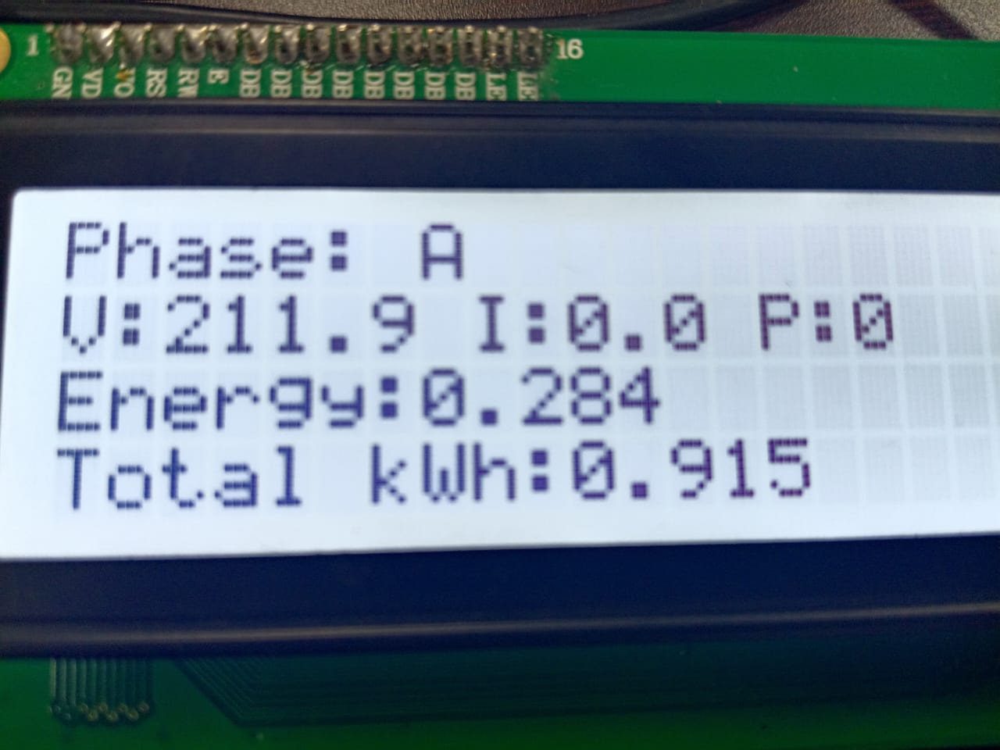
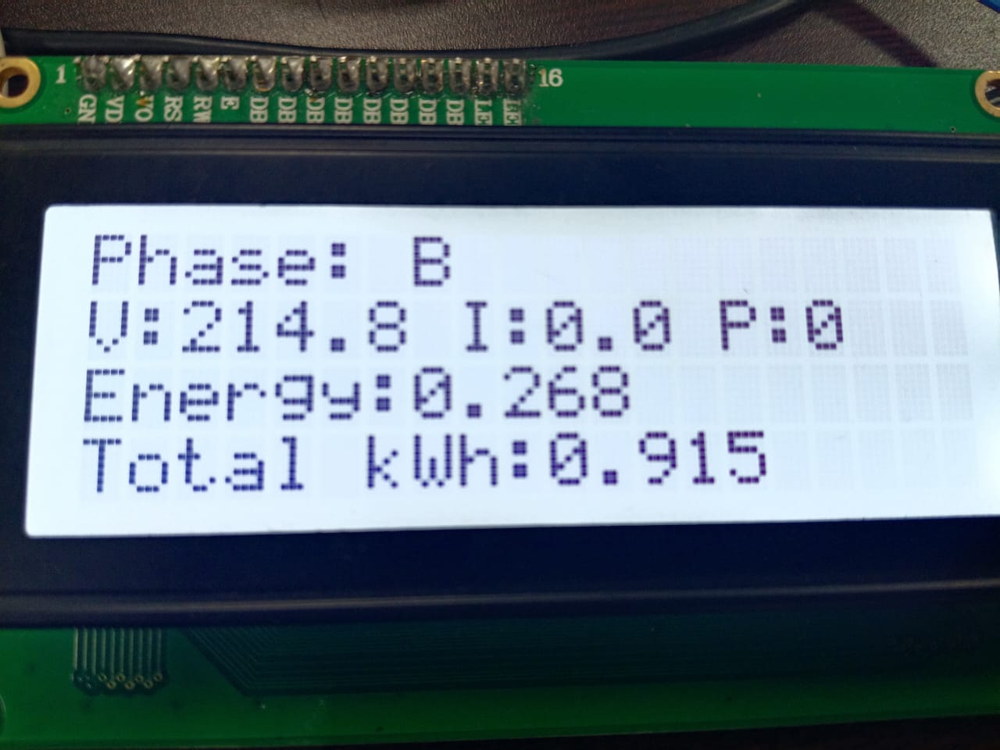
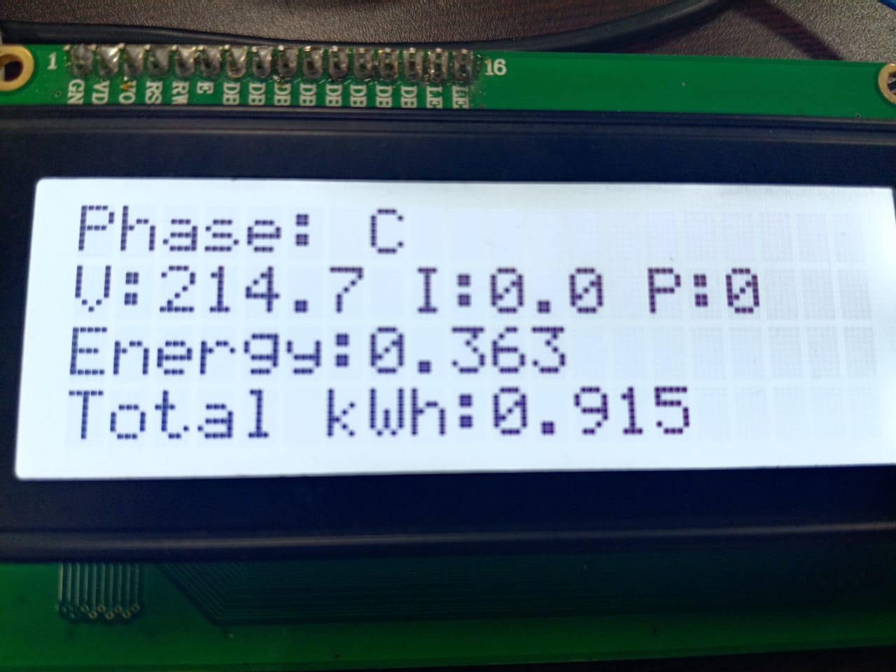

#  ESP32-Based 3-Phase Energy Meter

This project is a **3-Phase Energy Monitoring System** built using the **ESP32**, capable of accurately measuring voltage, current, apparent power, and energy (kWh) for **each phase (A, B, C)**. It displays real-time data on a **20x4 I2C LCD** and logs energy values into **EEPROM**, making it ideal for industrial or lab applications.

---

##  Features

-  Real-time LCD display with auto-scroll (3s interval)
-  Measures:
  - Voltage (Vrms)
  - Current (Irms)
  - Apparent Power (W)
  - Energy (kWh)
-  EEPROM logging every 5 mins
-  Noise filtering and range validation
-  3-phase support using ZMPT101B & SCT-013 sensors
-  Serial Monitor logs for debugging

---

##  Components Used

| Component                       | Quantity | Notes                                      |
|--------------------------------|----------|--------------------------------------------|
| ESP32 Dev Board                | 1        | Main microcontroller                       |
| ZMPT101B Voltage Sensor        | 3        | One per phase (A, B, C)                    |
| SCT-013 Current Sensor (100A)  | 3        | One per phase (A, B, C)                    |
| 20x4 I2C LCD Display           | 1        | Address: `0x3F`                             |
| I2C Level Shifter              | 1        | For safe communication with LCD if 5V used |
| Resistors                      | 3–6      | Burden resistors for current sensors       |
| Breadboard/Wires/Enclosure     | -        | For wiring and protection                  |

---

##  ESP32 Pin Configuration

| Signal               | GPIO Pin |
|----------------------|----------|
| Phase A - Voltage    | 34       |
| Phase A - Current    | 33       |
| Phase B - Voltage    | 35       |
| Phase B - Current    | 25       |
| Phase C - Voltage    | 32       |
| Phase C - Current    | 26       |
| I2C LCD SDA          | 23       |
| I2C LCD SCL          | 22       |

---

##  LCD Display Output

The LCD scrolls automatically through each phase every 3 seconds.

### 🔵 Phase A Display



### 🟢 Phase B Display



### 🔴 Phase C Display



---

##  Serial Monitor Output

Serial output will look like this (9600 baud):

```
Phase |    V (V) |    I (A) |    P (W) |   kWh
------------------------------------------------
  A   |   220.5   |   0.50  |   110.0  |   0.004
  B   |   215.2   |   0.75  |   161.4  |   0.006
  C   |   221.3   |   0.00  |     0.0  |   0.003
------------------------------------------------
Total kWh:   0.013
```

---

##  EEPROM Logging

Energy values are written to EEPROM every **5 minutes** if there's a 0.005 kWh increase:

| EEPROM Address | Stores  |
|----------------|---------|
| 0              | kWhA    |
| 4              | kWhB    |
| 8              | kWhC    |

---

##  Calibration Values

Ensure accurate measurements by calibrating your sensors. Below are the optimized calibration values used in the code:

| Phase | Voltage Calibration | Current Calibration |
|-------|----------------------|---------------------|
| A     | 83.3                 | 216.4               |
| B     | 80.2                 | 171.9               |
| C     | 85.8                 | 171.9               |

---
---

##  Safety Warning

- Handle AC connections with **extreme caution**
- Always use **isolation**, **optocouplers**, and **fuses**
- Enclose your device securely to avoid shocks or fire hazards

---

## 📜 License

```
MIT License

Copyright (c) 2025 Naveen Kumar

Permission is hereby granted, free of charge, to any person obtaining a copy
of this software and associated documentation files (the “Software”), to deal
in the Software without restriction, including without limitation the rights
to use, copy, modify, merge, publish, distribute, sublicense, and/or sell
copies of the Software, and to permit persons to whom the Software is
furnished to do so, subject to the following conditions:

THE SOFTWARE IS PROVIDED “AS IS”, WITHOUT WARRANTY OF ANY KIND.
```

---

##  Author

- **Naveen Kumar S**
- GitHub: [@Naveendev360](https://github.com/Naveendev360)
- LinkedIn: [naveen-kumar](https://www.linkedin.com/in/naveen-kumar-31a168251/)

---

## ⭐ Support & Contributions

If this project helped you, consider giving it a ⭐ star on GitHub.  
Pull requests and suggestions are welcome!

